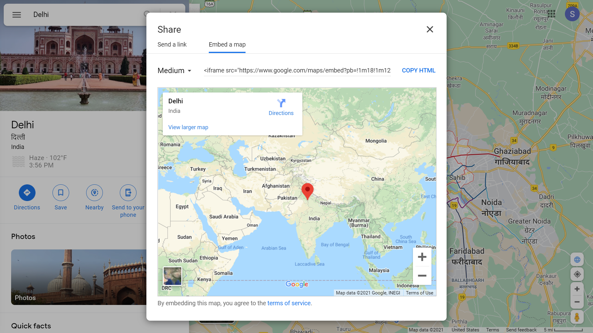
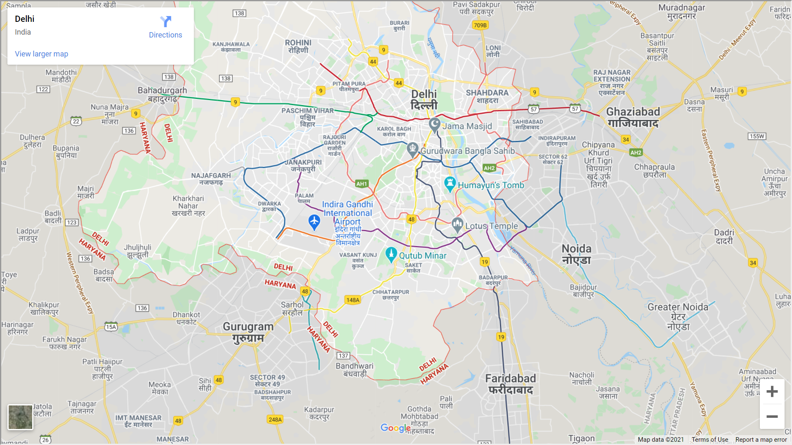
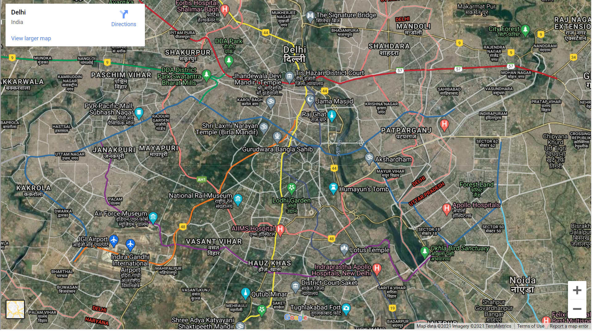

## Want to know how to embed google map in html file?

 

 

## How to embed Google Map?

### just click on Embed a map 

## Want to see the hosted Google Map project?
### Just link on the link below
### [Click here](https://sagar-sharma-7.github.io/Google-Map/)

 
 

 ## Cloning this repositary using command line
 1. Open **Git Bash**.
 1. Change the current working directory to the location where you want the cloned directory.
 1. Type `git clone https://github.com/Sagar-Sharma-7/Google-Map.git`
 1. Press **Enter** to create the clone of this repositary.

 ## How to reach me?
 
 

  

## If you have any color which you want to be part of my color palette then please pull request or write hex code of color in issues...

 

 

